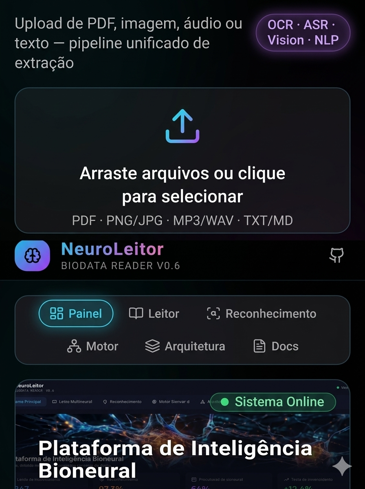

# 🧠 NeuroLeitor

**BioData Reader v0.6.2** — Leitor multimodal com motor bioneural, reconhecimento e correção de erros.

[](https://github.com/producerdcs-cpu/neuro-leitor)
[](#estado-atual)
[](https://neuro-leitor.vercel.app)
[](https://neuro-leitor-copy-production.up.railway.app/api/health)
[](https://dcsproducer-hub.vercel.app/)




> Demo da interface em produção — upload multimodal, navegação e **Sistema Online**.

**Parte do portfólio GenAI / produto DcsProducer®.**  
1º lançamento público da sequência de governança (Lista_Projetos · ordem 1).

| | |
|---|---|
| **Live (frontend)** | [neuro-leitor.vercel.app](https://neuro-leitor.vercel.app) |
| **API** | [Railway production](https://neuro-leitor-copy-production.up.railway.app) |
| **Health** | [GET /api/health](https://neuro-leitor-copy-production.up.railway.app/api/health) |
| **Projects Hub** | [dcsproducer-hub.vercel.app](https://dcsproducer-hub.vercel.app/) |
| **Portfólio executivo** | [core-hub-aegis.vercel.app](https://core-hub-aegis.vercel.app/) |

Deploy passo a passo: [docs/DEPLOY.md](./docs/DEPLOY.md) · Checklist: [CHECKLIST.md](./CHECKLIST.md) · Arquitetura: [docs/ARCHITECTURE.md](./docs/ARCHITECTURE.md)

---

## O que é

PWA + API para leitura multimodal de documentos e mídia, com pipeline de reconhecimento e correção. Stack: **React · Vite · Tailwind · Framer Motion** (frontend) e **Node** (API na Railway).

| Capacidade | Status |
|------------|--------|
| Upload e processamento via API | ✅ Produção |
| Visualizar conteúdo extraído | ✅ |
| Ouvir (TTS do navegador) | ✅ |
| PWA instalável no celular | ✅ |
| Header *Sistema Online* | ✅ |
| OCR / ASR reais (Tesseract, Whisper…) | 📋 Fase 3 |

---

## Estado atual

| Área | Status |
|------|--------|
| **Frontend + PWA** | ✅ Online (Vercel) · instalável |
| **Fase 1 — MVP** | ✅ Concluído |
| **Fase 2 — Backend** | ✅ Concluído (Railway + `VITE_API_URL` + Visualizar/Ouvir) |
| **Fase 3 / 4** | 📋 Planejado (OCR real, Whisper, Vision, auth) |

---

## Deploy em produção (resumo)

### Railway (API)

| Item | Valor |
|------|--------|
| Root Directory | `server` |
| Domain | `https://neuro-leitor-copy-production.up.railway.app` |
| Variáveis | `PORT`, `HOST`, `NODE_ENV`, `CORS_ORIGIN`, `OCR_PROVIDER=local`, `ASR_PROVIDER=local`, `CORRECTION_PROVIDER=local` |

### Vercel (Frontend)

| Item | Valor |
|------|--------|
| URL | `https://neuro-leitor.vercel.app` |
| Env | `VITE_API_URL=https://neuro-leitor-copy-production.up.railway.app` |
| Após mudar env | Redeploy **sem** cache de build |

Detalhes: [docs/DEPLOY.md](./docs/DEPLOY.md).

---

## Fase 2 — Backend (fechada)

| Módulo | Endpoint | Status |
|--------|----------|--------|
| **Health** | `GET /api/health` | ✅ Produção |
| **Process** | `POST /api/process` | ✅ Produção (providers locais) |
| **Correção** | `POST /api/correct` | ✅ |
| **Sessões** | `/api/sessions` | ✅ JSON em disco |
| **Frontend** | `VITE_API_URL` no Vercel | ✅ |
| **UI** | Visualizar + Ouvir | ✅ |

Providers atuais: `local`. OCR/ASR **reais** → **Fase 3**.

---

## Como rodar local

### Backend

```bash
cd server
npm install
npm run dev
# → http://localhost:3001/api/health
```

### Frontend

```bash
npm install
npm run dev
# → http://localhost:5173
```

Opcional: `.env` com `VITE_API_URL=http://localhost:3001` ou a URL do Railway.

---

## API (produção)

```bash
curl https://neuro-leitor-copy-production.up.railway.app/api/health
curl -F "file=@doc.png" https://neuro-leitor-copy-production.up.railway.app/api/process
curl -X POST https://neuro-leitor-copy-production.up.railway.app/api/correct \
  -H "Content-Type: application/json" \
  -d '{"text":"reconehcimento multimod@l"}'
```

---

## Estrutura

```
server/
├── index.js · routes/api.js
├── services/ ocr · asr · correction · pipeline · vision · tts
└── store/sessions.js

src/
├── components/ ArchitecturePanel · MultimodalReader · DocsPanel …
├── services/api.ts
├── lib/tts.ts
└── pages/Index.tsx

docs/ARCHITECTURE.md · DEPLOY.md · CI.md
CHECKLIST.md
```

---

## Roadmap

| Fase | Status |
|------|--------|
| 1 — MVP | ✅ Concluído |
| 2 — Backend (API cloud + PWA) | ✅ Concluído |
| 3 — OCR/ASR reais, Vision, TTS avançado | 📋 Planejado |
| 4 — Escala, auth, analytics | 📋 Planejado |

---

## Portfólio DcsProducer®

Este repositório é o **primeiro lançamento público** da sequência definida em `Lista_Projetos.xlsx` (ordem 1), após fechamento da ordem 0 (skill `pdf-wordpress-editor` + [Projects Hub](https://dcsproducer-hub.vercel.app/)).

- Código de produto e demos sanitizadas: este repo + live Vercel/Railway.
- Governança e planilha: Hub privado + skill.
- Segurança / AEGIS: pointer público apenas em [`aegis-dcs`](https://github.com/producerdcs-cpu/aegis-dcs) (sem motor).

---

## NOTICE

MIT © 2026 **DcsProducer® Creative Studio** / [producerdcs-cpu](https://github.com/producerdcs-cpu)

Marca e identidade visual: DcsProducer®.  
Sem segredos, datasets proprietários ou motor AEGIS/DUC neste repositório.
