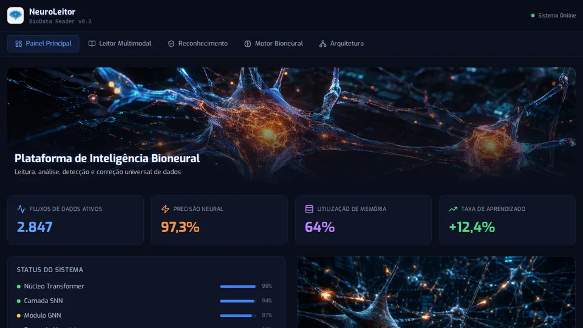

# 🧠 NeuroLeitor

**BioData Reader v0.6.1 — PWA + Backend Fase 2**




-purple?style=flat-square)


---

## Estado atual

| Área | Status |
|------|--------|
| **Frontend + PWA** | ✅ Online (Vercel) · instalável no celular |
| **Fase 1 — MVP** | ✅ Concluído |
| **Fase 2 — Backend** | 🟡 API local completa; falta deploy cloud |
| **Fase 3 / 4** | 📋 Planejado |

> O site já opera a interface e a apostila. Fases 2–4 “completas de verdade” (API cloud + PWA full) pedem deploy do backend + redeploy do frontend com `VITE_API_URL`.

Veja o **[CHECKLIST.md](./CHECKLIST.md)** e a **[documentação técnica da Arquitetura](./docs/ARCHITECTURE.md)**.

---

## Fase 2 — Backend (local pronto)

| Módulo | Endpoint | Providers |
|--------|----------|-----------|
| **OCR** | `POST /api/process` | local-mock · tesseract.js · OpenAI vision |
| **ASR** | `POST /api/process` | local-mock · OpenAI Whisper |
| **Correção** | `POST /api/correct` | local-rules · OpenAI |
| **Sessões** | `/api/sessions` | JSON em `server/store/sessions/` |
| **Health** | `GET /api/health` | status + providers |

Frontend usa a API quando está online; senão usa mock.

---

## Como rodar

### Backend

```bash
cd server
npm install
npm run dev
# → http://localhost:3001/api/health
```

Opcional cloud:

```bash
cp .env.example .env
# OPENAI_API_KEY=sk-...
# OCR_PROVIDER=openai ASR_PROVIDER=openai CORRECTION_PROVIDER=openai
```

### Frontend

```bash
npm install
npm run dev
# → http://localhost:5173
```

Produção (Vercel): push em `main` → rebuild automático.

---

## API

```bash
curl http://localhost:3001/api/health
curl -F "file=@doc.png" http://localhost:3001/api/process
curl -X POST http://localhost:3001/api/correct -H "Content-Type: application/json" \
  -d '{"text":"reconehcimento multimod@l"}'
```

---

## Estrutura

```
server/
├── index.js · routes/api.js
├── services/ ocr · asr · correction · pipeline · vision · tts
└── store/sessions.js

src/
├── components/ ArchitecturePanel · MultimodalReader · DocsPanel …
├── services/api.ts
├── data/docsContent.ts
└── pages/Index.tsx

docs/ARCHITECTURE.md
CHECKLIST.md
```

---

MIT © 2026 Producer DCS · [producerdcs-cpu/neuro-leitor](https://github.com/producerdcs-cpu/neuro-leitor)
